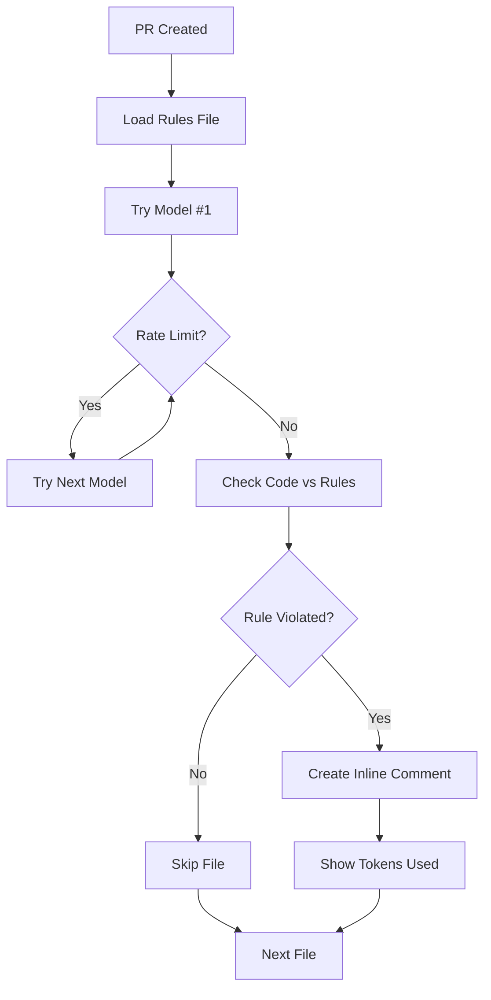

# 🤖 AI Code Review - Project Rules Enforcer

Clean, focused GitHub Actions workflow that enforces ONLY your project rules using Google Gemini AI models.

---

## 🚀 Quick Start (3-minute setup)

### 1. Get Your API Key
1. Visit [Google AI Studio](https://aistudio.google.com/app/apikey)
2. Create a new API key (free)

### 2. Add Secret to GitHub
1. Go to your repo → **Settings** → **Secrets and variables** → **Actions**
2. Click **New repository secret**
3. Name: `GEMINI_API_KEY`
4. Value: Your API key from step 1

### 3. Create Project Rules File
Create `.github/copilot-instructions.md` with YOUR project rules:
```markdown
# Copilot Instructions (PR reviews)

## Our Rules
1) Architecture: application code must be in /apps/*, libraries in /packages/*; new top-level folders are prohibited.
2) Patterns: database access only via /packages/data/*. Direct calls outside this layer are prohibited.
3) Security: do not store secrets, do not commit .env, keys/tokens are forbidden.
4) Style/Quality: ESLint + Prettier according to repo configs; tests are mandatory for new code.
5) Documentation: All new code must include relevant documentation updates.

## Test
- If the word BANANA appears in the code — write the phrase "INSTRUCTIONS PICKED UP" in each comment.
```

### 4. Configure Workflow (Optional)
Edit `.github/workflows/ai-code-review.yml`:
```yaml
env:
  MODEL_CHOICE: 1                                      # Model 1-13 (Default: gemini-2.5-pro)
  INSTRUCTIONS_FILE: '.github/copilot-instructions.md' # Path to your rules file
  TEMPERATURE: 0                                       # AI determinism (0=strict, 1=creative)
  MAX_FILES: 20                                        # Max files per PR
  MAX_DIFF_SIZE: 8000                                  # Max chars per file
```

**✅ Done!** AI enforces ONLY your documented rules.

---

## 🎯 Key Features

### 🎯 **Rules-Only Focus**
- **STRICTLY enforces your project rules** from instructions file
- **No generic advice** - only violations of YOUR documented standards
- **Clean, noise-free reviews** focused on what matters to your project

### 🧠 **Smart Model Fallback**
- **13 Google Gemini models** with automatic failover
- **Rate limit handling** - seamlessly tries next model when limits hit
- **Always uses best available model** for highest quality reviews

### 📋 **Configurable Instructions**
- **Custom rules file path** via `INSTRUCTIONS_FILE` variable
- **Easy rule changes** - just edit your instructions file
- **Flexible setup** - can point to any markdown file with rules

### 📊 **Token Transparency**
- **Real-time token usage** displayed in each comment
- **Mathematical validation** of API token calculations
- **Thinking tokens detection** for advanced models (when available)
- **Free tier monitoring** to track usage limits

### 🎨 **Clean Comments**
- **Inline code suggestions** with exact fixes
- **Rule references** showing which specific rule was violated
- **Model attribution** with token breakdown

---

## 🤖 Available Models (Ordered by Power)

| # | Model | Description | Best For |
|---|-------|-------------|----------|
| 1 | `gemini-2.5-pro` ⭐ | **DEFAULT** Highest quality | Complex analysis, best reviews |
| 2 | `gemini-2.5-flash` | Fast & efficient | Daily reviews, speed |
| 3 | `gemini-2.5-flash-lite` | Lightweight | High volume |
| 4 | `gemini-2.0-flash` | Advanced features | Modern codebases |
| 5 | `gemini-2.0-flash-lite` | High frequency | Active repos |
| 6-13 | Various specialized | Live, TTS, Legacy | Special use cases |

**Free Tier Limits**: 5-100 requests/minute, 100-1K requests/day
*See workflow file for complete limits*

---

## ⚙️ How It Works



### 🔍 **Review Process**
1. **Loads** your rules from configurable instructions file
2. **Tries models** in priority order (most powerful first)  
3. **Checks** each file diff against YOUR rules ONLY
4. **Creates** inline comments only for rule violations
5. **Shows** token usage and model attribution

### 📁 **File Structure**
```
.github/
├── workflows/
│   └── ai-code-review.yml        # Main workflow
└── copilot-instructions.md       # Project rules (configurable path)
```

---

## 🛠️ Configuration

### Environment Variables
All settings in `.github/workflows/ai-code-review.yml`:

```yaml
env:
  # Model Selection (1-13)
  MODEL_CHOICE: 1              # Default: gemini-2.5-pro (highest quality)
  
  # Instructions File Path  
  INSTRUCTIONS_FILE: '.github/copilot-instructions.md'  # Your rules file
  
  # AI Behavior
  TEMPERATURE: 0               # 0=deterministic, 1=creative (recommended: 0)
  
  # Review Limits
  MAX_FILES: 20               # Max files per PR (recommended: 10-20)
  MAX_DIFF_SIZE: 8000         # Max characters per file (recommended: 5K-10K)
```

### Custom Rules File
Change `INSTRUCTIONS_FILE` to use different rules:
```yaml
INSTRUCTIONS_FILE: 'docs/review-rules.md'      # Custom path
INSTRUCTIONS_FILE: '.github/team-standards.md' # Team-specific rules
```

### Rule Format
Your instructions file can contain:
- Project-specific rules numbered 1, 2, 3...
- Special test instructions (e.g., BANANA test)
- Severity guidelines
- Blocking comment requirements

**Note**: AI follows ONLY what's written in your instructions file - no built-in assumptions.

---

## 📈 Example Comments

### Basic Rule Violation
```
🤖 AI Review 🔴 MAJOR: Architecture violation detected

📋 Project Rule Violation: Rule 1

This code creates a new top-level folder 'services' which violates our architecture rule. 
Application code must be in /apps/*, libraries in /packages/*.

Suggested fix:
```suggestion
// Move this file to /apps/api/services/ or /packages/shared/services/
```

---
🔮 Generated by: gemini-2.5-flash (Priority 2)
📊 Token usage: 1,123 input + 89 output = 1,212 total
```

### With Thinking Tokens (Advanced Models)
```
🤖 AI Review 🛡️ SECURITY: Secret detection

📋 Project Rule Violation: Rule 3

Environment variable contains what appears to be an API key committed to code.

---
🔮 Generated by: gemini-2.5-pro (Priority 1)
📊 Token usage: 1,456 input + 67 output + 234 thinking = 1,757 total
```

### Special Test Instruction
```
🤖 AI Review 📌 MAJOR: Test instruction triggered

INSTRUCTIONS PICKED UP - detected BANANA in code

---
🔮 Generated by: gemini-2.5-flash (Priority 2)
📊 Token usage: 892 input + 23 output = 915 total
```

---

## 🚨 Troubleshooting

### No Comments Appearing?
1. **Check rules file exists**: Your `INSTRUCTIONS_FILE` path is valid
2. **Verify API key**: `GEMINI_API_KEY` secret is set correctly
3. **Check Actions logs**: Look for errors in workflow execution
4. **Test with known violation**: Make a change that clearly violates your rules

### Rate Limit Errors?
- **"All models exhausted"** = free tier limits hit on ALL 13 models
- **Wait for reset**: Limits reset hourly/daily depending on model
- **Reduce usage**: Lower `MAX_FILES` or `MAX_DIFF_SIZE`
- **Upgrade tier**: Consider paid Google AI plan for higher limits

### Wrong File Path?
```yaml
# Update the instructions file path
INSTRUCTIONS_FILE: 'path/to/your/rules.md'
```

### AI Not Following Rules?
- **Be specific**: Write clear, numbered rules in your instructions file
- **Test instructions**: Add BANANA test to verify AI reads your file
- **Set TEMPERATURE: 0**: For consistent rule enforcement

### Token Usage Issues?
- **High usage**: Reduce `MAX_DIFF_SIZE` and `MAX_FILES`
- **Math errors**: We show both calculated and API-reported totals when they differ
- **Thinking tokens**: Advanced models (2.5-pro) show internal reasoning process

### Performance Optimization?
```yaml
# For faster reviews
MODEL_CHOICE: 2          # Use gemini-2.5-flash instead of 2.5-pro
MAX_FILES: 10           # Review fewer files
MAX_DIFF_SIZE: 5000     # Smaller diffs
```

---

## � Resources

- **Google AI Studio**: [Get your free API key](https://aistudio.google.com/app/apikey)
- **GitHub Actions**: [Workflow documentation](https://docs.github.com/en/actions)
- **Gemini API**: [Rate limits and pricing](https://ai.google.dev/pricing)

---

## 📝 Philosophy

This AI Code Review tool is designed with a **rules-first approach**:

- ✅ **Enforces YOUR rules** - not generic best practices
- ✅ **Zero noise** - only comments on documented violations  
- ✅ **Configurable** - easy to customize for any project
- ✅ **Transparent** - shows exactly which model and tokens used
- ✅ **Reliable** - automatic fallback when rate limits hit

**Perfect for teams that want AI code review focused on their specific standards.**

---

*🔥 Built with GitHub Actions + Google Gemini AI • Focus on YOUR rules, not generic advice*
