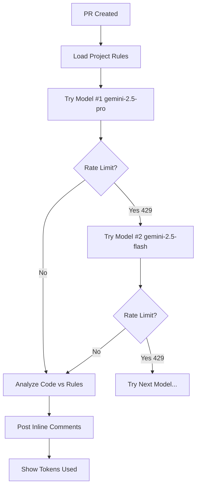

# 🤖 AI Code Review Sandbox

Advanced GitHub Actions workflow for automated code review using Google Gemini AI models with intelligent model fallback and token tracking.

---

## 🚀 Quick Start (2-minute setup)

### 1. Get Your API Key
1. Visit [Google AI Studio](https://aistudio.google.com/app/apikey)
2. Create a new API key (free)

### 2. Add Secret to GitHub
1. Go to your repo → **Settings** → **Secrets and variables** → **Actions**
2. Click **New repository secret**
3. Name: `GEMINI_API_KEY`
4. Value: Your API key from step 1

### 3. Configure Model (Optional)
Edit `.github/workflows/ai-code-review.yml`:
```yaml
env:
  MODEL_CHOICE: 2  # Change this number (1-13, see models below)
```

### 4. Create Project Rules
Create `.github/copilot-instructions.md` with your project rules:
```markdown
## Our Rules
1) Architecture: application code must be in /apps/*, libraries in /packages/*
2) Patterns: database access only via /packages/data/*
3) Security: do not store secrets, do not commit .env files
4) Style/Quality: ESLint + Prettier according to repo configs
5) Documentation: All new code must include relevant documentation
```

**✅ Done!** AI will now review your PRs automatically.

---

## 🎯 Key Features

### 🧠 **Smart Model Selection**
- **13 Google Gemini models** available (from most powerful to fastest)
- **Automatic fallback** when rate limits hit (429 errors)
- **Always starts with best model** available

### 📊 **Token Tracking**
- **Real-time token usage** displayed in each comment
- Shows `input + output = total` tokens used
- Helps monitor Free Tier limits

### 📋 **Project-Specific Rules**
- **Only comments on YOUR rules** (no generic advice)
- **Must reference specific rule** (e.g. "Violates Rule 1")
- **No noise** - only violations of your documented standards

### 🎨 **Smart Comments**
- **Inline suggestions** with exact code fixes
- **Severity levels**: 🛡️ Security, 🔴 Major
- **Model attribution** showing which AI and tokens used

### 🔄 **Robust Fallback**
- **Rate limit handling** - automatically tries next model
- **Error recovery** - continues review even if one model fails
- **Complete failure protection** - only stops when ALL models exhausted

---

## 🤖 Available Models (Ordered by Power)

| # | Model | Description | Best For |
|---|-------|-------------|----------|
| 1 | `gemini-2.5-pro` | Highest quality | Complex analysis |
| 2 | `gemini-2.5-flash` ⭐ | **RECOMMENDED** | Daily reviews |
| 3 | `gemini-2.5-flash-lite` | Lightweight | High volume |
| 4 | `gemini-2.0-flash` | Advanced features | Modern codebases |
| 5 | `gemini-2.0-flash-lite` | High frequency | Active repos |
| 6-13 | Various specialized | Live, TTS, Legacy | Special use cases |

**Free Tier Limits**: 5-100 requests/minute, 100-1K requests/day
*See workflow file for complete limits*

---

## ⚙️ How It Works



### 🔍 **Review Process**
1. **Loads** your project rules from `.github/copilot-instructions.md`
2. **Starts** with most powerful model available
3. **Checks** each changed file against YOUR rules only
4. **Falls back** to next model if rate limited
5. **Creates** inline comments with exact fixes
6. **Shows** token usage and model used

### 📁 **File Structure**
```
.github/
├── workflows/
│   └── ai-code-review.yml     # Main workflow (13 models + fallback)
└── copilot-instructions.md    # YOUR project rules (required)
```

---

## 🛠️ Customization

### Change Model Priority
Edit the workflow to reorder `MODELS_BY_PRIORITY` array.

### Adjust Limits
```yaml
MAX_FILES: 20        # Files to review per PR
MAX_DIFF_SIZE: 8000  # Characters per file diff
```

### Rule Severity
- **Architecture violations** → 🛡️ Security
- **Other rule violations** → 🔴 Major

---

## 📈 Example Comment

```
🤖 AI Review 🔴 MAJOR: Direct database access detected

📋 Project Rule Violation: Rule 2

This code directly imports from database layer instead of using 
/packages/data/* abstraction as required by our architecture.

Suggested fix:
```suggestion
import { getUserData } from '/packages/data/users';
```

---
🔮 Generated by: gemini-2.5-flash (Priority 2)
📊 Token usage: 1,250 input + 87 output = 1,337 total
```

---

## 🚨 Troubleshooting

**No comments appearing?**
- Check `.github/copilot-instructions.md` exists
- Verify `GEMINI_API_KEY` is set in repo secrets
- Look at Actions logs for errors

**"All models exhausted" error?**
- You've hit Free Tier limits on all models
- Wait for limits to reset (hourly/daily)
- Consider upgrading to paid tier

**Too many generic comments?**
- Update your `.github/copilot-instructions.md` to be more specific
- AI only comments on violations of YOUR documented rules

---

*🔥 Built with GitHub Actions + Google Gemini AI*
	 curl -o actions-runner-linux-x64-2.316.0.tar.gz -L https://github.com/actions/runner/releases/download/v2.316.0/actions-runner-linux-x64-2.316.0.tar.gz
	 tar xzf ./actions-runner-linux-x64-2.316.0.tar.gz
	 # Configure
	 ./config.sh --url https://github.com/<owner>/<repo> --token <TOKEN>
	 # Start
	 ./run.sh
	 ```
4. Add to workflow:
	 ```yaml
	 runs-on: self-hosted
	 ```

---

## Useful Links
- [GitHub Actions Documentation](https://docs.github.com/en/actions)
- [Self-hosted Runners](https://docs.github.com/en/actions/hosting-your-own-runners/about-self-hosted-runners)
- [Actions Marketplace](https://github.com/marketplace?type=actions)

---

*This guide is designed for quick onboarding and reference. For advanced topics, see the official documentation.*
